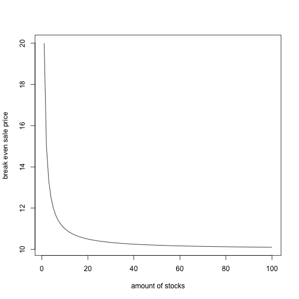

## Small investors view
<ul><li>Small investors usually make small investments</li><li>With these investments the transactions of buying and selling stock can be significant</li><li>These cost effect the expected profit, expecially when buying small amount of stocks</li></ul>

---

## Effect of transaction costs
Here is a example. Stock is currently at 10 and transaction costs (selling and buying) are 10 combined. What is the stock price at when we break even, regarding on how many stocks we are buying? The plot below shows this in detail.

---
## Break even plot

--- 
## The application
This application is to address the problem shown above. If investor has only small amount of money to invest the transactional costs can make the investment very bad. With the application you can estimate the amount needed to investl, effect of transactional cost, wanted return percentage and stock history in the same application. The stock data is loaded directly from Yahoo, so user only needs to add ones own data.  <b>Data is displayed in one simple graph that helps to make small investors big decisions.</b>
